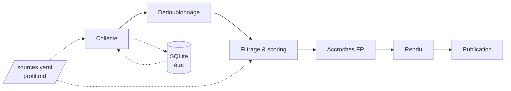
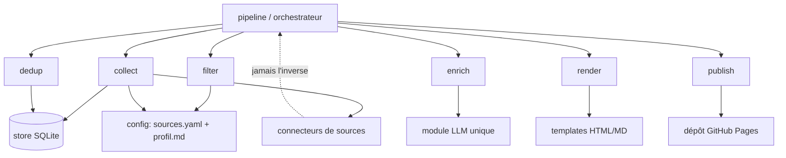
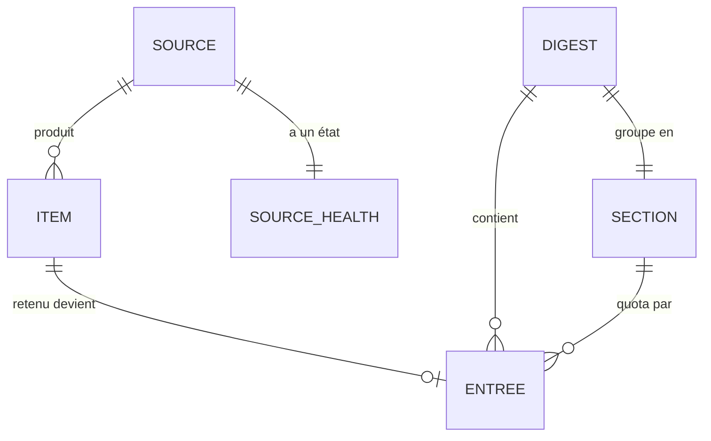
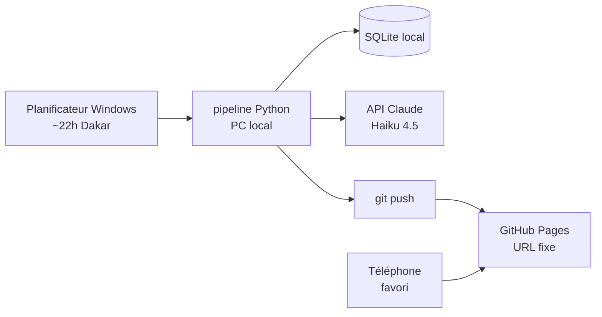

# Architecture Spine — Agent de veille IA

## Design Paradigm

**Pipes-and-filters.** Le système est un pipeline nocturne d'étapes discrètes, chacune consommant la sortie de la précédente via un contrat de données explicite :



Chaque étape est un module isolé (`collect`, `dedup`, `filter`, `enrich`, `render`, `publish`) sous un paquet Python unique. Un orchestrateur (`pipeline`) les enchaîne. Les étapes ne se connaissent pas : elles échangent des listes d'`Item`/`Entrée`, jamais des états internes.

## Invariants & Rules



*Règle de dépendance : l'orchestrateur dépend des étapes ; les étapes dépendent des modules transverses (store, config, connecteurs, llm). Aucune dépendance ne remonte.*

### AD-1 — Paradigme pipeline
- **Binds:** all
- **Prevents:** des étages qui se mélangent, lisent ou mutent les internes des autres
- **Rule:** chaque étape expose une fonction pure d'entrée→sortie sur des types partagés (`list[Item]`, `list[Entrée]`) ; aucun accès direct d'une étape à une autre ; seul l'orchestrateur ordonne.

### AD-2 — Connecteurs derrière une interface uniforme
- **Binds:** FR-1, FR-3
- **Prevents:** le code de collecte couplé aux spécificités de chaque source
- **Rule:** tout type de source (RSS, API JSON, scraping) implémente un contrat commun `Connector.fetch() -> list[Item]`. Ajouter une source ne modifie que la configuration ou ajoute un connecteur ; jamais le pipeline.

### AD-3 — Sources et Profil sont de la configuration, pas du code
- **Binds:** FR-1, FR-5, FR-6
- **Prevents:** modifier le code pour ajouter/retirer une source ou re-régler le filtrage
- **Rule:** le socle de sources (`sources.yaml`), les seuils, les quotas et le Profil (`profil.md`) vivent en fichiers de configuration lus au démarrage. Aucune valeur de réglage n'est codée en dur.

### AD-4 — `Item` est la forme interne canonique
- **Binds:** FR-1, FR-3, FR-4
- **Prevents:** deux connecteurs émettant des formes incompatibles
- **Rule:** tout connecteur produit des `Item` portant au moins : `source_id`, `guid` (URL ou hash stable), `titre`, `date_publication` (ISO 8601 UTC), `langue`, `registre`, `url`, `contenu_brut`, plus `signal: float | None = None` (optionnel, neutre par défaut). Les étapes aval ne consomment que ces champs.

> **Amendement du 2026-08-27** (Story 1.4) — l'invariant initial n'exposait que 8 champs et interdisait toute consommation au-delà. FR-4 (seuil de signal par source) n'était couvert par aucun champ d'`Item`. Décision : ajouter `signal` comme 9ᵉ champ, optionnel et neutre par défaut, plutôt que de coder le seuil dans chaque connecteur (option écartée : elle aurait violé AD-3 — le seuil serait revenu en dur dans le code — et rendu le filtrage invisible au récapitulatif). L'intention protégée par AD-4 — empêcher des connecteurs d'émettre des formes *incompatibles* — reste intacte : un champ optionnel absent par défaut ne casse aucun connecteur existant. Détail : [1-4-scoring-par-profil.md](../../../implementation-artifacts/1-4-scoring-par-profil.md#Dev-Notes).

### AD-5 — SQLite, propriétaire unique de l'état
- **Binds:** FR-3, FR-12
- **Prevents:** deux propriétaires de l'état de dédoublonnage ou de santé des sources
- **Rule:** un fichier SQLite local est la seule source de vérité pour le « déjà vu par source » et l'`État d'une Source`. Seuls le contrôle de santé et l'étape `publish` (validation du « déjà vu », cf. AD-11) écrivent le store ; les autres le lisent au besoin.

### AD-6 — Isolation des pannes de source
- **Binds:** FR-2
- **Prevents:** une seule mauvaise source qui tue le digest
- **Rule:** chaque `fetch()` de source est encapsulé ; toute erreur (timeout, 403, 429) est capturée, journalisée dans l'état de santé, et n'interrompt pas la collecte des autres sources. Backoff sur les sources sensibles au débit.

### AD-7 — Frontière LLM unique
- **Binds:** FR-7, FR-8
- **Prevents:** des appels API dispersés, un coût non maîtrisé, un modèle difficile à changer
- **Rule:** la génération d'accroches est le seul point appelant l'API Claude, derrière un module `enrich.llm` unique. Le modèle et le budget sont paramétrés là ; aucune autre partie du code n'appelle l'API.

### AD-8 — Publication par commit git vers GitHub Pages
- **Binds:** FR-9, FR-10
- **Prevents:** des mécanismes de publication divergents ; une page et une archive stockées séparément
- **Rule:** l'étape `publish` écrit la page HTML et l'entrée d'archive Markdown dans un dépôt servi par GitHub Pages, puis commit/push. Page (vitrine, URL fixe) et Archive (mémoire versionnée) partagent le même dépôt.

### AD-9 — Job nocturne idempotent
- **Binds:** FR-11
- **Prevents:** doublons d'archive et double publication lors d'une reprise
- **Rule:** relancer le pipeline pour une même date écrase (upsert par date) le digest de cette date au lieu d'en créer un second. Une reprise après échec est donc sûre.

### AD-10 — Aucune source en violation de CGU, aucun secret publié
- **Binds:** all
- **Prevents:** une v1 bâtie sur une source coupable du jour au lendemain ; une fuite de clé
- **Rule:** aucun connecteur ne contourne un robots.txt ou des CGU interdisant la collecte (LinkedIn, emploisenegal.com, Wellfound…). Les secrets vivent en `.env` local non versionné ; la sortie publiée ne contient aucun secret.

### AD-11 — L'état « déjà vu » n'est validé qu'après publication réussie
- **Binds:** FR-3, FR-11
- **Prevents:** la perte silencieuse d'items si le pipeline plante entre la collecte et la publication
- **Rule:** un `Item` n'est marqué « déjà vu » dans le store qu'**après** que l'étape `publish` a réussi, dans la même transaction. Un run interrompu avant la publication ne modifie pas l'état « déjà vu » ; la reprise reconsidère les mêmes items. Résout le conflit entre AD-5 (qui possède l'état) et AD-9 (reprise sûre).

## Consistency Conventions

| Concern | Convention |
| --- | --- |
| Nommage | modules et fichiers en `snake_case` ; une étape = un module (`collect.py`, `filter.py`…) ; connecteurs suffixés `_connector.py` |
| Dates | ISO 8601, UTC en interne ; affichage converti en heure de Dakar (UTC+0, donc identiques) au rendu |
| Identité d'item | `guid` = identifiant natif du flux (`<guid>`/`<id>`) si présent, sinon URL canonique, sinon hash SHA-256 de (source_id + titre) — un identifiant natif est conçu pour être permanent, contrairement à une URL qui peut varier (tracking, migration) ; le dédoublonnage inter-sources compare l'URL cible, distincte du champ `guid` |
| Erreurs | try/except par source → écriture dans `source_health` ; jamais d'exception qui remonte à l'orchestrateur et avorte le run |
| Config | YAML pour `sources.yaml` ; Markdown pour `profil.md` ; lus une fois au démarrage du run |
| Secrets | variables d'environnement via `.env` (python-dotenv), gitignoré ; jamais commit |
| Journalisation | log fichier horodaté par run ; le récapitulatif de santé des sources est produit en fin de run |

## Stack

| Name | Version |
| --- | --- |
| Python | 3.11 |
| uv (env & exécution) | installé |
| feedparser (RSS/Atom) | 6.0.12 |
| httpx (HTTP API & scraping) | courant |
| anthropic (accroches) | 0.119.0 |
| — modèle | claude-haiku-4-5-20251001 |
| Jinja2 (templates HTML/MD) | courant |
| PyYAML (config sources) | courant |
| python-dotenv (secrets) | courant |
| SQLite | stdlib (module `sqlite3`) |
| Hébergement page + archive | GitHub Pages (dépôt public) |
| Ordonnancement | Planificateur de tâches Windows |

## Structural Seed

```text
veille-ia/
  pyproject.toml          # géré par uv
  .env                    # secrets, gitignoré
  config/
    sources.yaml          # socle de sources (AD-3)
    profil.md             # profil de filtrage (AD-3)
  src/veille/
    pipeline.py           # orchestrateur (AD-1)
    models.py             # Item, Entrée, Digest, État source (AD-4)
    store.py              # accès SQLite, propriétaire de l'état (AD-5)
    collect.py            # collecte + isolation des pannes (AD-2, AD-6)
    connectors/           # un module par type de source (AD-2)
      rss_connector.py
      json_connector.py   # HF Daily Papers, Kaggle…
      scrape_connector.py # Anthropic news…
    dedup.py              # dédoublonnage (AD-4)
    filter.py             # signal → pertinence → quotas (FR-4/5/6)
    enrich/
      llm.py              # frontière LLM unique (AD-7)
    render.py             # HTML + Markdown via Jinja2
    publish.py            # commit/push GitHub Pages (AD-8)
    health.py             # fraîcheur & mise en sommeil des sources (FR-12/13)
    discover.py           # découverte de nouvelles sources (FR-14)
  templates/
    digest.html.j2
    digest.md.j2
  site/                   # sortie publiée (dépôt GitHub Pages) — peut être un sous-module ou un repo distinct
    index.html            # dernière page (URL fixe)
    archive/YYYY-MM-DD.md  # archive versionnée
```

Entités et relations (les attributs appartiennent au code ; seuls les invariants figurent en AD-4) :



Déploiement (tout local sauf l'hébergement de la page) :



## Capability → Architecture Map

| Capability / Area | Lives in | Governed by |
| --- | --- | --- |
| FR-1 Collecte hétérogène | `collect.py`, `connectors/` | AD-2, AD-4 |
| FR-2 Tolérance aux pannes | `collect.py`, `health.py` | AD-6 |
| FR-3 Dédoublonnage | `dedup.py`, `store.py` | AD-4, AD-5 |
| FR-4/5/6 Filtrage, scoring, quotas | `filter.py`, `config/` | AD-3, AD-4 |
| FR-7/8 Accroches FR + recommandations | `enrich/llm.py` | AD-7 |
| FR-9/10 Page + archive | `render.py`, `publish.py` | AD-8 |
| FR-11 Génération nocturne | `pipeline.py`, Planificateur | AD-9 |
| FR-12/13 Santé des sources | `health.py`, `store.py` | AD-5, AD-6 |
| FR-14 Découverte de sources | `discover.py` | AD-2, AD-3 |

## Deferred

- **Format exact de `sources.yaml`** (champs par source) — appartient au code une fois `models.py` posé ; l'invariant est AD-3/AD-4, pas le schéma détaillé.
- **Schéma SQLite précis** (tables, colonnes) — détail d'implémentation ; AD-5 fixe la propriété, pas les colonnes.
- **Dédoublonnage sémantique** (au-delà de l'URL identique) — reporté par le PRD ; v1 s'en tient à l'URL/GUID (AD-4).
- **Stratégie de reprise fine** (nombre de tentatives, intervalle) — l'invariant est l'idempotence (AD-9) ; la politique de retry est un réglage.
- **Repli GitHub Actions** (si le PC allumé la nuit devient une contrainte) — documenté au PRD ; ne change pas les AD, seulement le déclencheur (`sched`).
- **Digest audio, agent emploi, multi-utilisateur** — hors périmètre v1 (Non-Goals du PRD).
